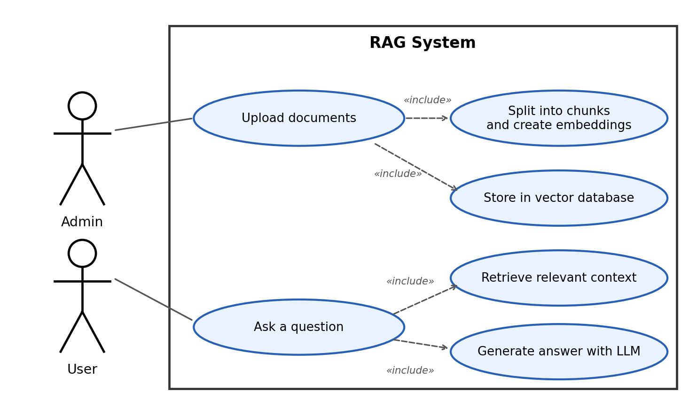

# RAG App

A **Retrieval-Augmented Generation (RAG)** application built with **Python** and **FastAPI**.
The project is built step by step to understand how a RAG system works end to end: from loading documents to getting an LLM answer grounded in your own data.

## Table of Contents

1. [Overview](#overview)
2. [Tech Stack](#tech-stack)
3. [Use Case Diagram](#use-case-diagram)
4. [Prerequisites](#prerequisites)
5. [Getting Started (Step by Step)](#getting-started-step-by-step)
6. [Environment Variables](#environment-variables)
7. [Running the Application](#running-the-application)
8. [Project Structure](#project-structure)
9. [Troubleshooting](#troubleshooting)
10. [Roadmap](#roadmap)

---

## Overview

A plain LLM only knows what it was trained on. A RAG system adds your own documents to the loop:

1. Documents are split into chunks and converted into embeddings.
2. Embeddings are stored in a vector database.
3. When a user asks a question, the most similar chunks are retrieved.
4. The chunks are injected into the prompt as context.
5. The LLM answers using that context.

```
User → FastAPI → Document Retrieval → Relevant Context → LLM → Answer
```

## Tech Stack

| Layer          | Technology                          |
| -------------- | ----------------------------------- |
| Language       | Python 3.14.6                       |
| Web framework  | FastAPI                             |
| ASGI server    | Uvicorn                             |
| Environment    | Conda                               |
| Config         | `.env` file                         |
| LLM / Vector DB| Configured via environment variables (see below) |

## Use Case Diagram

What the system does. It will be updated as the RAG pipeline evolves.



## Prerequisites

| Tool   | Version  | Check command        |
| ------ | -------- | -------------------- |
| Python | 3.14.6   | `python --version`   |
| Conda  | latest   | `conda --version`    |
| Git    | latest   | `git --version`      |

## Getting Started (Step by Step)

### 1. Clone the repository

```bash
git clone https://github.com/YoussefAhmed100/rag-system.git
cd rag-system
```

### 2. Create and activate the Conda environment

```bash
conda create -n rag-system python=3.14.6
conda activate rag-system
python --version   # Expected: Python 3.14.6
```

You should see `(rag-system)` at the start of your terminal prompt.

### 3. Install dependencies

```bash
pip install -r requirements.txt
```

### 4. Configure environment variables

Create your local `.env` from the example:

| Shell                  | Command                          |
| ---------------------- | -------------------------------- |
| Git Bash / Linux / macOS | `cp .env.example .env`         |
| Windows CMD            | `copy .env.example .env`         |
| PowerShell             | `Copy-Item .env.example .env`    |

Open `.env` and fill in the values (see the next section).

> **Important:** never commit `.env`. It may contain API keys and database credentials.

### 5. Run the server

```bash
uvicorn app.main:app --reload
```

### 6. Verify

- API: <http://localhost:8000>
- Swagger UI: <http://localhost:8000/docs>

## Environment Variables

Copy the exact variable names from `.env.example`. Typical values for a RAG setup:

| Variable     | Required | Description                               | Example           |
| ------------ | -------- | ----------------------------------------- | ----------------- |
| `APP_ENV`    | Yes      | Runtime environment                       | `development`     |
| `API_KEY`    | Depends  | LLM provider API key                      | `sk-...`          |
| `MODEL_NAME` | Depends  | LLM / embedding model name                | `your-model-name` |
| `DATABASE_URL` | Depends | Vector DB / database connection string  | `your-connection` |

## Running the Application

```bash
conda activate rag-system
uvicorn app.main:app --reload
```

Useful options:

```bash
uvicorn app.main:app --reload --port 8080      # custom port
uvicorn app.main:app --host 0.0.0.0            # expose on the network
```

## Project Structure

```
rag-system/
├── app/                 # FastAPI application (entry point: app/main.py)
├── .env.example         # Environment variables template
├── .gitignore
├── requirements.txt     # Python dependencies
└── README.md
```

## Troubleshooting

| Problem | Cause | Fix |
| ------- | ----- | --- |
| `conda: command not found` | Conda not on PATH | Open *Anaconda Prompt* or run `conda init` then restart the terminal |
| `ModuleNotFoundError` | Dependencies not installed or wrong env | `conda activate rag-system` then `pip install -r requirements.txt` |
| `Could not import module "app.main"` | Running from the wrong folder | Run `uvicorn` from the repo root, where the `app/` folder is |
| `Address already in use` | Port 8000 is busy | Use `--port 8080` or stop the other process |
| `pip` fails building a package on Python 3.14 | Package has no wheel for 3.14 yet | Upgrade the package, or check its release notes for 3.14 support |
| Authentication / 401 from the LLM | Missing or wrong `API_KEY` | Re-check `.env` and restart the server |

## Roadmap

- [ ] Document loading
- [ ] Text splitting / chunking
- [ ] Embeddings
- [ ] Vector database
- [ ] Similarity search and retrieval
- [ ] Prompt construction
- [ ] LLM integration
- [ ] Full RAG pipeline exposed via FastAPI endpoints